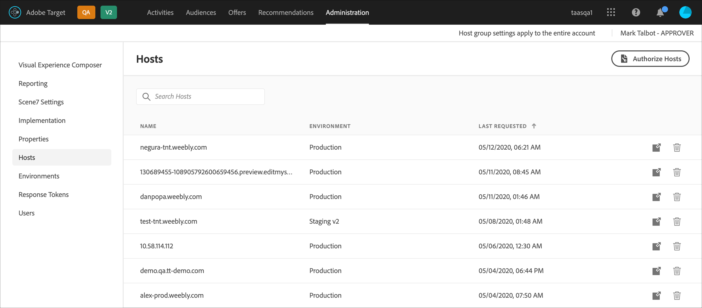

# Hosts{#hosts}

Organize your sites and pre-production environments for easy management and separated reporting.

>[!NOTE]
>
>The information in this topic has been updated to give you a sneak peak at the UI changes coming in the [!DNL Target] Standard/Premium 20.6.1 release (July 2020). Most of the information presented in this topic applies to the current UI; however, options might be in slightly different locations.

The primary goal of host management is to ensure that no inactive content accidentally appears on websites. Host management also lets you separate report data by [environment](/help/administrating-target/environments.md).

A host is any domain from which a [!DNL Target] request is made. On a website, it is usually the `location.hostname` property of the URL making the [!DNL Target] request.

By default, [!DNL Target] does not limit a host that can make [!DNL Target] requests and receive [!DNL Target] responses. When new hosts make requests, they automatically work. This also enables testing on different domains you don’t know or can’t anticipate. If you want to override this default behavior, you can set up an allowlist or blocklist to limit which hosts will work with [!DNL Target].

To manage hosts, click **[!UICONTROL Administration]** > **[!UICONTROL Hosts]**.

## Recognizing hosts {#concept_0D4B43E23AA9408F8B28A57ED754BF65}

To recognize a host and add it to the [!UICONTROL Hosts] list, the following conditions must be met:

* At least one [!DNL Target] request must exist on the host 
* A page on the host must have the following:

    * An accurate at.js or mbox.js reference 
    * A [!DNL Target] request or an auto-generated global [!DNL Target] request

* The page with the [!DNL Target] request must be viewed in a browser

After the page is viewed, the host is listed in the [!UICONTROL Hosts] list, allowing you to manage it in an environment, as well as preview and launch activities and tests.

>[!NOTE] {class="- topic/note "}
>
>This includes any personal development servers.

After a host is added to the [!UICONTROL Host] list, make sure that the host is recognized.

1. Click **[!UICONTROL Administration]** > **[!UICONTROL Hosts]**. 
1. If your host is not listed, refresh your browser.

   By default, a newly recognized host is placed in the [!UICONTROL Production] environment. This is the safest environment because it does not allow inactive activities to be viewed from these hosts.

1. (Conditional) Click the **[!UICONTROL Move]** icon (  ) to move the host into the [!UICONTROL Development], [!UICONTROL Staging], or other environment.

>[!NOTE]
>
>The [!UICONTROL Production] environment cannot be deleted, even if you rename it. It is assumed that this is where you will serve final, active activities and tests. The default environment does not allow inactive campaigns to be viewed.

## Sort or search the Hosts list {#section_068B23C9D8224EB78BC3B7C8580251B0}

To sort the [!UICONTROL Hosts] list, click any column header ([!UICONTROL Name], [!UICONTROL Environment], or [!UICONTROL Last Requested]) to sort the list in ascending or descending order.

To search the [!UICONTROL Hosts] list, type a search term in the [!UICONTROL Search Hosts] box.

## Create allowlists that specify hosts that are authorized to send Target requests to Target. {#allowlist}

You can create an allowlist that specifies hosts (domains) that are authorized to send [!DNL Target] requests to [!DNL Target]. All other hosts generating requests will get a commented-out authorization error response. By default, any host that contains a [!DNL Target] request registers with [!DNL Target] in the [!UICONTROL Production] environment and has access to all active and approved activities. If this is not the desired approach, you can instead use the allowlist to record specific hosts that are eligible to make [!DNL Target] requests and receive [!DNL Target] content. All hosts will continue to display in the [!UICONTROL Hosts] list, and environments can still be used to group these hosts and assign different levels to each, such as whether the host can see active and/or inactive activities.

To create an allowlist:

1. From the [!UICONTROL Hosts] list, click **[!UICONTROL Authorize Hosts]**. 
1. Enable the **[!UICONTROL Enable Authorized Hosts for content delivery]** toggle. 
1. Add the desired hosts in the **[!UICONTROL Host contains]** box, as desired.

   Multiple hosts can be listed, each on its own line.

1. Add the desired hosts in the **[!UICONTROL Host does not contains]** box, as desired.

   Multiple hosts can be listed, each on its own line.

1. Click **[!UICONTROL Save]**.

If a [!DNL Target] request is made on an unauthorized host, the call will respond with `/* no display - unauthorized mbox host */`.

>[!IMPORTANT]
>
>**Security best practices**: If you use ubox functionality of [!DNL Target], note that this allowlist will also control the list of domains to which your [redirectors](/help/c-implementing-target/c-non-javascript-based-implementation/working-with-redirectors.md) can navigate. Ensure that you add any domains to which you want to redirect when you use ubox as a part of your implementation. If the allowlist is left unspecified, [!DNL Adobe] will not be able to verify the redirect URLs and protect from potential malicious redirects.
>
>The allowlist takes precedence over environments. You should clear out all hosts before using the allowlist feature, then only the hosts allowed by the allowlist appear in your hosts list. You can then move the hosts into the desired environment.

Sometimes domains from other sites appear in your environments. A domain appears in the list if the domain makes a call to your at.js or mbox.js. For example, if somebody copies one of your web pages to their server, that domain appears in your environment. You might also see domains from spider engines, language translator sites, or local disk drives.

In cases where `mboxHost` is passed in an API call, conversion is recorded for the environment that is passed in. If no environment is passed, the host in the call defaults to [!UICONTROL Production].

You can also create a denylist that specifies hosts (domains) than cannot send [!DNL Target] requests to [!DNL Target] by adding the desired hosts in the [!UICONTROL Host Does Not Contain] box.

>[!NOTE]
>
>Because the Authorized Hosts list is used for both [!DNL Target] hosts and default redirect hosts, you must add all existing domains approved to use the [!DNL Adobe Target] Javascript SDK (at.js) *AND* all domains used in ubox default redirect URLs. You must also add any new similar domains to the allowlist in the future.

## Delete a host {#section_F56355BA4BC54B078A1A8179BC954632}

You can delete a host when it is no longer needed.

1. From the [!UICONTROL Hosts] list, click the **[!UICONTROL Delete]** icon. 
1. Click **[!UICONTROL Delete]** to confirm the deletion.

>[!NOTE]
>
>The host will be listed again if anyone browses to an page that contains a [!DNL Target] request on the host.

## Troubleshooting hosts {#concept_B3D7583FA4BB480382CC7453529FE1B7}

Try the following troubleshooting tips if you experience problems with your hosts:

**Host does not appear in the list for your account.**

* Refresh the [!UICONTROL Hosts] page in your browser. 
* Confirm that the [!DNL Target] request is correct, including the at.js or mbox.js reference. 
* Try browsing to one of the [!DNL Target] requests on the host. It's possible that no [!DNL Target] request on the host was ever rendered in a browser.

**Random or unknown domains appear in the [!UICONTROL Host] list.**

A domain appears in this list if a request to [!DNL Target] is made from the domain. Often, you could see domains from spider engines, language translator sites, or local disk drives. If the listed domain is not one your team uses, you can click [!UICONTROL Delete] to remove it.

**My [!DNL Target] request returns /&#42; no display - unauthorized mbox host &#42;/.**

If a [!DNL Target] request is made on an unauthorized host, the request will respond with /&#42; no display - unauthorized mbox host &#42;/.
