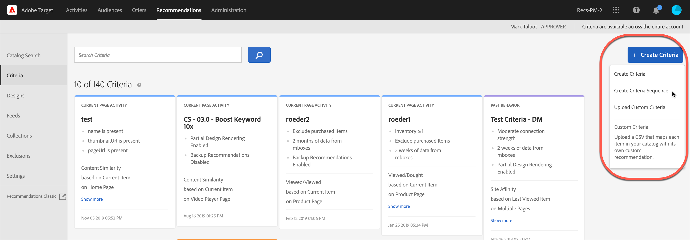

#  Create criteria sequences

Use sequences of up to five criteria to exercise greater control of the items that appear in your [!UICONTROL Recommendations] activities.

>[!NOTE]
>
>Criteria sequences cannot be used with [!UICONTROL Recommendations] activities created before the October 2016 Release of [!DNL Target Premium].

To create a criteria sequence, you must first create the criteria you want to include in the sequence. See [Create criteria](/help/c-recommendations/c-algorithms/create-new-algorithm.md) for more information.

By using a criteria sequence, you can provide additional targeted recommendations, instead of using more generic backup recommendations, when a criteria doesn't return enough results to fill your design. Typically, a criteria sequence will proceed from more specific targeting, which might return fewer results, to more general targeting, which usually returns more results.

Your criteria sequences might vary in order depending on the page type, as shown in the following examples:

|Page type|Possible sequence order|
| --- | --- |
|Product page|<ol><li>Based on current item, from same brand</li><li>Based on current item, from all brands</li><li>Based on content similarity</li><li>Based on top sellers</li><li>Based on most-viewed items across the site</li></ol>|
|Home page|<ol><li>Based on visitor's last purchase </li><li>Based on visitor's favorite item</li><li>Based on visitor's favorite category</li><li>Based on top sellers</li><li>Based on most-viewed across site</li></ol>|

## Create a criteria sequence

You create criteria sequences from the [!UICONTROL Create Criteria Sequence] screen.

There are multiple ways to reach the [!UICONTROL Create Criteria Sequence] screen. Some screen options vary depending on how you reach the screen.

* On the **[!UICONTROL Recommendations]** > **[!UICONTROL Criteria]** library screen, click **[!UICONTROL Create Criteria]** > **[!UICONTROL Create Criteria Sequence]**. Criteria you create here are automatically made available for all [!UICONTROL Recommendations] activities.
* When you are creating a [!UICONTROL Recommendations] activity, from the Select Criteria screen, click **[!UICONTROL Create New]** > **[!UICONTROL Create Criteria Sequence]**. You will have the option to save your new criteria sequence for use with other [!UICONTROL Recommendations] activities. 
* When you are editing a [!UICONTROL Recommendations] activity, click in a [!UICONTROL Recommendations Location] box on your page, then select **[!UICONTROL Change Criteria]**. On the [!UICONTROL Select Criteria] screen, click **[!UICONTROL Create New]** > **[!UICONTROL Create Criteria Sequence]**. You will have the option to save your new criteria for use with other [!UICONTROL Recommendations] activities. 

The following steps assume you access the [!UICONTROL Create Criteria Sequence] screen by using the first method: the **[!UICONTROL Recommendations]** > **[!UICONTROL Criteria]** library screen.

1. Click **[!UICONTROL Recommendations]** > **[!UICONTROL Criteria]**.

1. Click **[!UICONTROL Create Criteria]** > **[!UICONTROL Create Criteria Sequence]**.

   

1. Fill in the information in the [Basic Information](/help/c-recommendations/c-algorithms/create-new-algorithm.md#info) section.

1. In the **[!UICONTROL Criteria Sequence]** section, click **[!UICONTROL Add Criteria]**.

   The sequence order defines the order in which a design is filled. If Criteria 1 does not have enough recommendations to fill your design, the remaining slots will be filled with Criteria 2, and so on.

   

1. On the [!UICONTROL Select Criteria] screen, select a criteria, then click **[!UICONTROL Add]**.

   You can use the Search box and the filter drop-downs to find the desired criteria.

   

1. (Optional) Slide the **[!UICONTROL Limit the number of items returned]** toggle to the "on" position, then specify the number of items (between 1 and 50).

   

   To help you understand the value of the [!UICONTROL Limit the number of items returned] option, consider the following use cases:

   * **Use Case 1**: You want to have a mix of different kinds of items in a single recommendations tray. For example, you want to show a mix of outerwear (jackets) and tops (shirts, T-shirts). To achieve this, use a Collection for the activity that includes all of the potential product types you want in any slots in your design. Then, set up your first criteria with a static filter limiting the criteria to include only outerwear, and set up your second criteria with a static filter limiting the criteria to include only tops. Finally, add both criteria to a criteria sequence and limit the first criteria to 2 slots.

     The recommendations tray might look like this on your site:

     

   * **Use Case 2**: You want a mix of both alternative items and complementary items. Set up one criteria to use a viewed/viewed algorithm and use a dynamic filter that limits the recommended items to the current item's category. Set up the second criteria to use a viewed/bought algorithm and use a dynamic filter that includes only recommended items that do not match the current item's category. Finally, add both criteria to a sequence and limit the first criteria to 2 slots.

1. Continue adding additional criteria to your sequence. You can add up to five criteria to a sequence. 

1. Enable [Backup Content options](/help/c-recommendations/c-algorithms/create-new-algorithm.md#content).

1. Click **[!UICONTROL Save]**.

   The criteria sequence will appear in the Criteria list.

   For more information about recommendation logic options, see [Criteria](../../c-recommendations/c-algorithms/algorithms.md).

## Training video: Create criteria in Recommendations (12:33) 

This video contains the following information:

* Create criteria
* Create criteria sequences
* Upload custom criteria

>[!VIDEO](https://video.tv.adobe.com/v/27694?quality=12)
