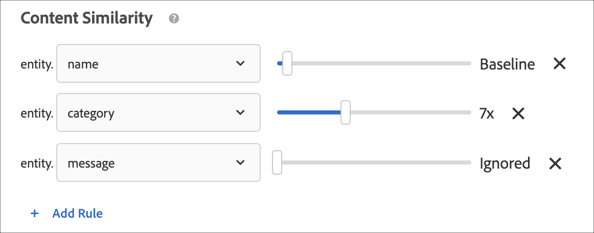
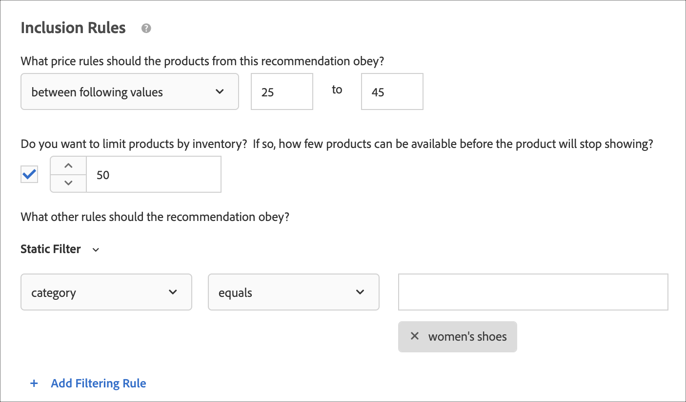
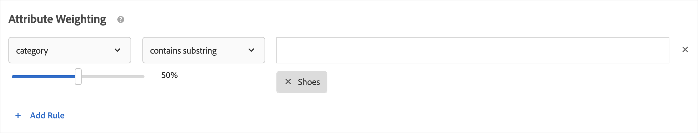

#  Create criteria{#create-criteria}

Criteria control the content of your [!UICONTROL Recommendations] activities. Create criteria to show the recommendations that are most appropriate for your activity.

## Create new criteria

The following sections explain how to create a new criteria.

### Access the Create New Criteria screen

There are multiple ways to reach the [!UICONTROL Create New Criteria] screen. Some screen options vary depending on how you reach the screen.

* On the **[!UICONTROL Recommendations]** > **[!UICONTROL Criteria]** library screen, click **[!UICONTROL Create Criteria]** > **[!UICONTROL Create Criteria]**. Criteria you create here are automatically made available for all [!DNL Recommendations] activities.
* When you are creating a [!DNL Recommendations] activity, click **[!UICONTROL Create Criteria]** on the [!UICONTROL Select Criteria] screen. You will have the option to save your new criteria for use with other [!DNL Recommendations] activities.
* When you are editing a [!DNL Recommendations] activity, click in a [!UICONTROL Recommendations Location] box on your page, and select **[!UICONTROL Change Criteria]**. On the [!UICONTROL Select Criteria] screen, click **[!UICONTROL Create Criteria]**. You will have the option to save your new criteria for use with other [!DNL Recommendations] activities.

The following steps assume you access the [!UICONTROL Create New Criteria] screen by using the first method: the **[!UICONTROL Recommendations]** > **[!UICONTROL Criteria]** library screen.

1. Click **[!UICONTROL Recommendations]** > **[!UICONTROL Criteria]**.

1. Click **[!UICONTROL Create Criteria]** > **[!UICONTROL Create Criteria]**.

   

### Fill in the Basic Information section {#info}

1. Type a **[!UICONTROL Criteria Name]**.

   This is the "internal" name used to describe the criteria. For example, you might want to call your criteria "Highest margin products," but you don't want that title to display publicly. See the next step to set the public-facing title.

   

1. Type a public-facing **[!UICONTROL Display Title]** to appear on the page for any recommendations that use this criteria.

   For example, you might want to display "People who viewed this viewed that" or "Similar products" when you use this criteria to show recommendations.

1. Type a short **[!UICONTROL Description]** of the criteria.

   The description should help you identify the criteria and might include information about the purpose of the criteria.

1. Select an **[!UICONTROL Industry Vertical]**:

   * [!UICONTROL Retail/Ecommerce]
   * [!UICONTROL Lead Generation/B2B/Financial Services]
   * [!UICONTROL Media/Publishing]

   Other criteria options will change based on the industry vertical you select. 

1. Select a **[!UICONTROL Page Type]**.

   You can select multiple page types.

   Together, the industry vertical and page types are used to categorize your saved criteria, making it easier to reuse criteria for other [!DNL Recommendations] activities.

1. Select a **[!UICONTROL Recommendation Key]**.

   For more information about basing criteria on a key, see [Base the recommendation on a recommendation key](../../c-recommendations/c-algorithms/create-new-algorithm.md#task_2B0ED54AFBF64C56916B6E1F4DC0DC3B). 

1. Select the **[!UICONTROL Recommendation Logic]**.

   For more information about recommendation logic options, see [Criteria](../../c-recommendations/c-algorithms/algorithms.md).

   >[!NOTE]
   >
   >If you select **[!UICONTROL Items]**/ **[!UICONTROL Media with Similar Attributes]**, you will have the option to set [content similarity rules](#similarity).

### Specify your data source options

>[!NOTE]
>
>The Data Source section displays only if your implementation uses [Analytics for Target](/help/c-integrating-target-with-mac/a4t/a4t.md) (A4T).

1. Set the **[!UICONTROL Data Range]** to determine the time range of available historical user behavior data to use when determining which recommendations to show.

   

   If your site has a lot of traffic and behaviors change frequently, choose a shorter data window. A shorter window enables [!DNL Recommendations] to be more responsive to changes in the market and in your business. For example, a shorter window means that [!DNL Recommendations] will detect changes in visitor behavior as your visitors begin seasonal shopping, such as back-to-school shopping or Christmas, and will recommend items appropriate to those shopping seasons.

   If you don't have a lot of data, or visitor behavior does not change frequently, you might select a longer window. However, for many sites, a shorter window results in better recommendations.

   The available data ranges are:

   * Two days 
   * One week 
   * Two weeks 
   * One month 
   * Two months

1. (Conditional) Select the desired **[!UICONTROL Behavioral Data Source]**: [!UICONTROL mboxes] or [!UICONTROL Analytics].

   

   If you chose [!UICONTROL Analytics], select the desired report suite.

   If the criteria uses [!DNL Adobe Analytics] as the behavioral data source, once created, the time for criteria availability depends on whether the selected report suite and lookback window has been used for any other criteria, as explained below:

   * **One-time report suite setup**: The first time a report suite is used with a given data range lookback window, [!DNL Target Recommendations] can take from two to seven days to fully download the behavioral data for the selected report suite from [!DNL Analytics]. This time frame is dependent on the [!DNL Analytics] system load.
   * **New or edited criteria using an already available report suite**: When creating a new criteria or editing an existing criteria, if the selected report suite has already been used with [!DNL Target Recommendations], with a data range equal to or lesser than the selected data range, then the data is immediately available and no one-time setup is required. In this case, or if an algorithm's settings are edited while not modifying the selected report suite or data range, the algorithm runs or re-runs within 12 hours.
   * **Ongoing algorithm runs**: Data flows from [!DNL Analytics] to [!DNL Target Recommendations] on a daily basis. For example, for the [!UICONTROL Viewed Affinity] recommendation, when a user views a product, a product-view tracking call is passed into [!DNL Analytics] close to real-time. The [!DNL Analytics] data is pushed to [!DNL Target] early the next day and [!DNL Target] runs the algorithm in less than 12 hours.

   For more information, see [Use Adobe Analytics with Target Recommendations](/help/c-recommendations/c-algorithms/use-adobe-analytics-with-recommendations.md).

### Specify content settings {#content}

Content rules determine what happens if the number of recommended items does not fill your design. It is possible for Recommendations criteria to return fewer recommendations than your design calls for. As an example, if your design has space for five items, but your criteria causes only three items to be recommended, you can leave the remaining space empty, or you can use backup recommendations to fill the extra space.

1. (Optional) Slide the **[!UICONTROL Partial Design Rendering]** toggle to the "on" position.

   As many slots as possible will be filled but the design template might include blank space for remaining slots.

1. (Optional) Slide the **[!UICONTROL Show Backup Recommendations]** toggle to the "on" position.

   Fill any remaining empty slots in the design with a random selection of most-viewed products from across your site.

   For more information, see [Use a backup recommendation](/help/c-recommendations/c-algorithms/backup-recs.md).

1. (Conditional) If you selected **[!UICONTROL Show Backup Recommendations]** in the previous step, you can enable **[!UICONTROL Apply inclusion rules to backup recommendations]**.

   Inclusion rules determine which items will be included in your recommendations. The options available depend on your industry vertical.

   For more details, see [Specify inclusion rules](#inclusion) below.

1. (Optional) Slide the **[!UICONTROL Recommend Previously Purchased Items]** toggle to the "on" position.

   This setting is based on the `productPurchasedId`. The default behavior is to not recommend previously purchased items. In most cases you do not want to promote items a customer has recently purchased. It is useful if you sell items that people typically purchase only once, such as kayaks. If you sell items that people come back to purchase again on a repeated basis, such as shampoo or other personal items, you should enable this option.

The following matrix shows the result you'll observe when using the [!UICONTROL Partial Design Rendering] and [!UICONTROL Backup Recommendations] options:

| Partial Design Rendering | Backup Recommendations | Result |
|--- |--- |--- |
|Disabled|Disabled|If fewer recommendations are returned than the design calls for, the recommendations design is replaced by default content and no recommendations are displayed.|
|Enabled|Disabled|The design is rendered, but may include blank space if fewer recommendations are returned than the design calls for.|
|Enabled|Enabled|Backup recommendations will fill available design "slots," fully rendering the design. If applying inclusion rules to backup recommendations restricts the number of qualifying backup recommendations to the point that the design cannot be filled, the design is partially rendered. If the criteria does not return any recommendations, and inclusion rules restrict backup recommendations to zero, the design is replaced with default content.|
|Disabled|Enabled|Backup recommendations will fill available design "slots," fully rendering the design. If applying inclusion rules to backup recommendations restricts the number of qualifying backup recommendations to the point that the design cannot be filled, the design is replaced by default content and no recommendations are displayed.|

### Specify content similarity rules {#similarity}

Use [!UICONTROL Content Similarity] rules to make recommendations based on item or media attributes.

>[!NOTE]
>
>If you selected **[!UICONTROL Items]**/ **[!UICONTROL Media with Similar Attributes]** as your [recommendation logic](#info), you will have the option to set content similarity rules.

Content similarity compares item attribute keywords and makes recommendations based on how many keywords different items have in common. Recommendations based on content similarity do not require past data to deliver strong results. 

Using content similarity to generate recommendations is especially effective for new items, which are not likely to show up in recommendations using *People Who Viewed This, Viewed That* and other logic based on past behavior. You can also use content similarity to generate useful recommendations for new visitors, who have no past purchases or other historical data. 

When you select **[!UICONTROL Items]**/ **[!UICONTROL Media with Similar Attributes]**, you have the option to create rules to increase or decrease the importance of specific item attributes in determining recommendations. For items such as books, you might want to boost the importance of attributes like *genre*, *author*, *series*, and so on, to recommend similar books.

Because content similarity uses keywords to compare items, some attributes, such as *message* or *description*, can introduce "noise" into the comparison. You can create rules to ignore these attributes. 

By default, all attributes are set to *Baseline*. You do not need to create a rule unless you want to change this setting.

>[!NOTE]
>
>The content similarity algorithm might use random sampling in computing similarity between items. As a result, similarity ratings between items might vary between algorithm runs.

### Specify inclusion rules {#inclusion}

Several options help you narrow the items that display in your recommendations. You can use inclusion rules while creating criteria or promotions. 

Inclusion rules are optional; however, setting these details gives you more control over the items that appear in your recommendations. Each detail you configure further narrows the display criteria. 

For example, you can choose to display only women's shoes that have an inventory of more than 50 and a price between $25 and $45. You can also weight each attribute so those items that are more important to your business are most likely to appear. 

As another example, you can choose to display job openings to visitors who visit your site only from certain cities and who have the required college degrees. 

Inclusion rule options vary by industry vertical. By default, inclusion rules are applied to backup recommendations.

>[!IMPORTANT]
>
>You should use inclusion rules cautiously. They are useful if, for example, your organization has rules that demand that one brand is not recommended while another brand is being shown. However, there is an opportunity cost to this feature. You could possibly lose a percentage of lift by restricting some items from not showing when they would normally be shown by the activity criteria. 

The inclusion rules are joined with an AND. All rules must be met to include an item in a recommendation. 

To create a simple inclusion rule, as mentioned previously, to display only women's shoes that have an inventory of more than 50 and a price between $25 and $45, perform the following steps: 

1. Set a price range for the products you want to recommend.
1. Set the minimum inventory amount for the products you want to recommend.
1. Configure the recommendation to display items only when they meet certain criteria.

   

   You can specify that items are included only when one of the attributes in the list meets or does not match one or more specified conditions. 

   The available evaluators depend on the value you choose in the first drop-down. You can list multiple items. These items are evaluated with OR. 

   Multiple rules are combined with an AND.

   >[!NOTE]
   >
   >This option limits the items that are displayed in the recommendation. It does not affect which pages the recommendation is displayed on. To limit where the recommendation displays, select the pages in the experience composer. 

For more information, see [Use dynamic and static inclusion rules](/help/c-recommendations/c-algorithms/use-dynamic-and-static-inclusion-rules.md).

### Specify attribute weighting

You can add multiple rules to "nudge" the algorithm based on important description or metadata about the content catalog so that certain items are more likely to be shown. 

For example, you can apply a higher weighting to on-sale items so they appear more often in the recommendation. Non-sale items are not completely excluded, but they appear less often. Multiple weighted attributes can be applied to the same algorithm, and the weighted attributes can be tested on split traffic in the recommendation. 

1. Choose a value.

   The value determines the type of item that is more likely to display, based on one of several available criteria. 

1. Choose an evaluator.

1. Type the keyword to complete the rule attributes.

   For example, the complete rule might be "Category contains substring shoes." 

   

1. Select the weight to assign to the rule.

   Options range from 0 to 100 in increments of 25. 
   
1. Add additional rules if desired.

When finished, click **[!UICONTROL Save]**.

If you are creating a new [!UICONTROL Recommendations] activity or editing an existing one, the **[!UICONTROL Save criteria for later]** check box is selected by default. If you do not want to use the criteria in other activities, clear the check box before saving.

## Base the recommendation on a recommendation key {#task_2B0ED54AFBF64C56916B6E1F4DC0DC3B}

Recommendations based on keys utilize visitor behavior context to show relevant results. 

There are two types of Recommendations: 

* **Popularity:** Lists items according to Most Viewed, Top Sold, and Top Metric. The key is empty for popularity criteria. 
* **Key-based:** Comprises the rest of the criteria. Recommendations offers a diverse set of choices with regard to the key type. The options range from "current item" to "profile parameters," which allow you to programmatically set the key of the values to recommend. You can test multiple criteria against each other by basing each criteria on a different key. 

Each criteria is defined in its own tab. Traffic is split evenly across your different criteria tests. In other words, if you have two criteria, traffic is divided equally between them. If you have two criteria and two designs, traffic is split evenly between the four combinations. You can also specify a percentage of site visitors who see the default content, for comparison. In that case, the specified percentage of visitors see the default content, and the rest are split between your criteria and design combinations. 

1. Create a new recommendation, or select an existing recommendation and click **[!UICONTROL Edit]**.
1. To change the recommendation key, select the new key from the [!UICONTROL Recommendation Key] drop-down list, then click **[!UICONTROL Save]**.

   Because different logic maps to different recommendations keys, different recommendations lend themselves to placement on different types of pages. Refer to the following sections for more information about each key.

### Current Item

The recommendation is determined by the item the visitor is currently viewing. 

Recommendations display other items that might interest visitors who are interested in the specified item.

When this option is selected, the `entity.id` value must be passed as a parameter in the display mbox.

**Logic (Criteria)**

* [!UICONTROL Items with similar attributes]
* [!UICONTROL People Who Viewed This, Viewed That]
* [!UICONTROL People Who Viewed This, Bought That]
* [!UICONTROL People Who Bought This, Bought That]
* [!UICONTROL Site Affinity]

**Where to use on your site**

Single-item pages, such as product pages.

Do NOT use on null search results pages.

### Current Category

The recommendation is determined by the product category that the visitor is currently viewing.

Recommendations display items in the specified product category.

When this option is selected, the `entity.categoryId` value must be passed as a parameter to the display mbox.

**Logic (Criteria)**

* Top Sellers
* Most Viewed

**Where to use on your site**

Single-category pages.

Do NOT use on null search results pages.

### Custom Attribute {#custom}

Recommendation is determined by an item that is stored in a visitor's profile, using either user.*x* or profile.*x* attributes.

When this option is selected, the `entity.id` value must be present in the profile attribute.

**Logic (Criteria)**

* [!UICONTROL People Who Viewed This, Viewed That]
* [!UICONTROL People Who Viewed This, Bought That]
* [!UICONTROL People Who Bought This, Bought That]
* [!UICONTROL Overall behavior]
* [!UICONTROL Most Viewed]
* [!UICONTROL Top Sellers]

If the key is a custom profile attribute and the algorithm type is Most Viewed or Top Sellers, a new drop-down list that displays called "Group By Unique Value Of" that has a list of known entity attributes (except ID, category, margin, value, inventory, and environment). This field is required.

**Where to use on your site**

Can be used on any pages.

**Use a custom recommendations key**

You can base recommendations on the value of a custom profile attribute. For example, suppose that you want to display recommended movies based on the movie that a visitor most recently added to his or her queue.

1. Select your custom profile attribute from the **[!UICONTROL Recommendation Key]** drop-down list (for example, “Last Show Added to Watchlist”).
1. Then select your **[!UICONTROL Recommendation Logic]** (for example "People Who Viewed This, Viewed That").

   

If your custom profile attribute doesn't directly match to a single entity ID, it is necessary to explain to [!DNL Recommendations] how you want the match to an entity to occur. For example, suppose that you want to display the top selling items from a visitor’s favorite brand.

1. Select your custom profile attribute from the **[!UICONTROL Recommendation Key]** drop-down list (for example, “Favorite Brand”).

1. Then select the **[!UICONTROL Recommendation Logic]** you want to use with this key (for example, "Top Sellers").

   The [!UICONTROL Group By Unique Value Of] option displays. 

1. Select the entity attribute that matches to the key you’ve chosen. In this case “Favorite Brand” matches to `entity.brand`.

   [!DNL Recommendations] now produces a “Top Sellers” list for each brand and shows the visitor the appropriate “Top Sellers” list based on the value stored in the visitor's Favorite Brand profile attribute.

   

### Last Purchased Item

The recommendation is determined by the last item that was purchased by each unique visitor. This is captured automatically, so no values need to be passed on the page.

**Logic (Criteria)**

* [!UICONTROL Items with similar attributes]
* [!UICONTROL People Who Viewed This, Viewed That]
* [!UICONTROL People Who Viewed This, Bought That]
* [!UICONTROL People Who Bought This, Bought That]
* [!UICONTROL Site Affinity]

**Where to use on your site**

Home page, My Account page, offsite ads.

Do NOT use on product pages or pages relevant to purchases.

### Last Viewed Item

The recommendation is determined by the last item that was viewed by each unique visitor. This is captured automatically, so no values need to be passed on the page.

**Logic (Criteria)**

* [!UICONTROL Items with similar attributes]
* [!UICONTROL People Who Viewed This, Viewed That]
* [!UICONTROL People Who Viewed This, Bought That]
* [!UICONTROL People Who Bought This, Bought That]
* [!UICONTROL Site Affinity]

**Where to use on your site**

Home page, My Account page, offsite ads.

Do NOT use on product pages or pages relevant to purchases.

### Most Viewed Item

The recommendation is determined by the item that has been viewed most often, using the same method as used for favorite category.

This is determined by recency/frequency criteria that works as follows:

* 10 points for first product view
* 5 points for every subsequent view
* At end of session divide all values by 2

For example, viewing surfboardA then surfboardB in one session results in A: 10, B: 5. When the session ends, you will have A: 5, B: 2.5. If you view the same items in the next session, the values change to A: 15 B: 7.5.

**Logic (Criteria)**

* [!UICONTROL Items with similar attributes]
* [!UICONTROL People Who Viewed This, Viewed That]
* [!UICONTROL People Who Viewed This, Bought That]
* [!UICONTROL People Who Bought This, Bought That]
* [!UICONTROL Site Affinity]

**Where to use on your site**

General pages, such as home or landing pages and offsite ads.

### Favorite Category

The recommendation is determined by the category that has received the most activity, using the same method used for "most viewed item" except that categories are scored instead of products.

This is determined by recency/frequency criteria that works as follows:

* 10 points for first category view
* 5 points for every subsequent view

Categories visited for the first time are given 10 points. 5 points are given for subsequent visits to the same category. With each visit, non-current categories that have been viewed before are decremented by 1.

For example, viewing categoryA then categoryB in one session results in A: 9, B: 10. If you view the same items in the next session, the values change to A: 20 B: 9.

**Logic (Criteria)**

* [!UICONTROL Top Sellers]
* [!UICONTROL Most Viewed]

**Where to use on your site**

General pages, such as home or landing pages and offsite ads.

### Popularity

The recommendation is determined by the popularity of items on your site. Popularity includes top sellers and top viewed by mbox data and, if you use Adobe Analytics, all of the metrics available in the product report. Items are ranked based on the Recommendation Logic you select.

**Logic (Criteria)**

* [!UICONTROL Top Sellers]
* [!UICONTROL Most Viewed]
* Product report metrics (if you are using Adobe Analytics)

**Where to use on your site**

General pages, such as home or landing pages and offsite ads.

### Recently Viewed Items {#recently-viewed}

Uses the visitor's history (spanning sessions) to present the last *x* items the visitor has viewed, based on the number of slots in the design.

The Recently Viewed Items criteria now returns results specific to a given [environment](/help/administrating-target/hosts.md). If two sites belong to different environments and a visitor switches between the two sites, each site shows only recently viewed items from the appropriate site. If two sites are in the same environment and a visitor switches between the two sites, the visitor will see the same recently viewed items for both sites.

**Where to use on your site**

General pages, such as home or landing pages and offsite ads.

>[!NOTE]
>
>Recently Viewed Items respects both Exclusions global settings and the selected Collection setting for the Activity. If an item is excluded by a global Exclusion, or is not contained in the selected Collection, it will not be displayed; therefore, when using a Recently Viewed Items criteria, the "All Collections" setting should generally be used.

## Training video: Create criteria in Recommendations (12:33) 

This video contains the following information:

* Create criteria
* Create criteria sequences
* Upload custom criteria

>[!VIDEO](https://video.tv.adobe.com/v/27694?quality=12)
