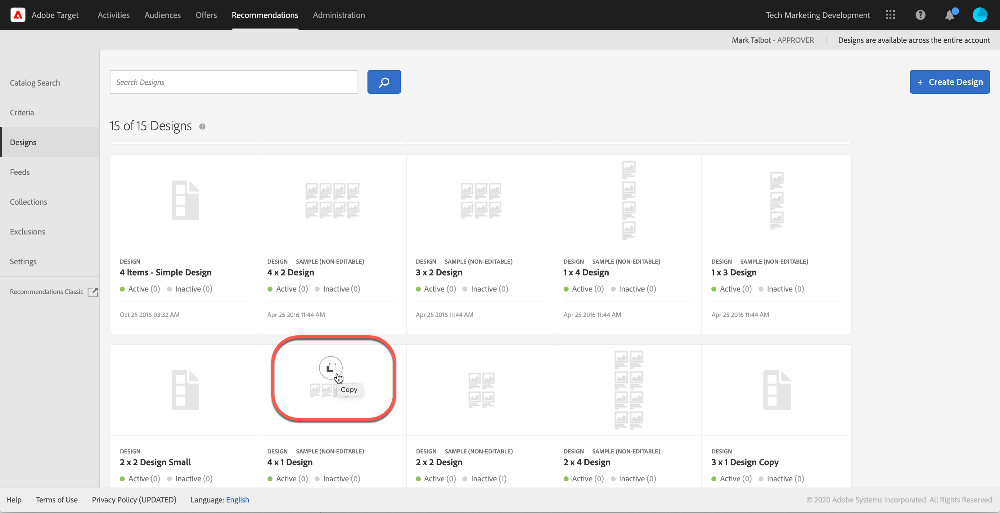
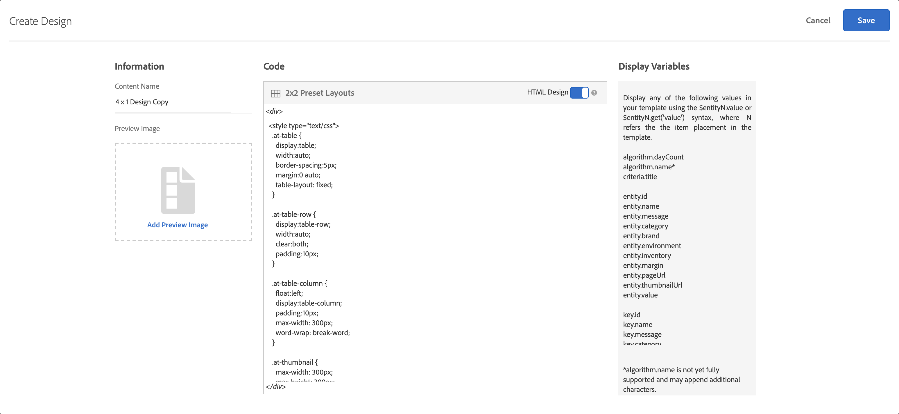

#  Create a design {#create-a-design}

A design defines how recommendations appear on a page.

You can create a [!UICONTROL Recommendations] design using a default design or by creating a custom design. The **[!UICONTROL Recommendations > Designs]** screen displays both default design cards and any designs that have been created in your account.

Keep the following information in mind as you work with designs:

* You can create a recommendations design by using a default design or you can create a custom design.
* You cannot edit or delete a default design.
* You can edit, copy, or delete a custom design.
* To create a design based on a default design, you must first copy the design and then edit the copy.

This illustration shows the default 1 x 4 design:


This illustration shows a custom design:


You can create a design during the activity-creation process from within the Visual Experience Composer (VEC) or from the design library outside of activity creation. The following sections assume you are creating designs from the library, but the steps are similar.

## Create designs

You can create a design based on a default design or you can create a custom design.

### Create a design based on a default design

1. Click **[!UICONTROL Recommendations]** > **[!UICONTROL Designs]** to display the [!UICONTROL Designs] library.

   

1. Mouse over the card for the design you want to create, then click the **[!UICONTROL Copy]** icon.

   

   The [!UICONTROL Create Design] dialog box displays.

   

1. In the **[!UICONTROL Information]** panel, add a **[!UICONTROL Content Name]** and optional preview image to display on the design card.

   When you use a default design, the design name and "Copy" appears in the **[!UICONTROL Content Name]** field. You can edit the name. You can also select an image to display on the design card.

1. (Conditional) Edit the design **[!UICONTROL Code]**, as desired.

   Recommendation designs use the open-source Velocity design language. Information about Velocity can be found at [https://velocity.apache.org](https://velocity.apache.org) and in [Customize a design using Velocity](/help/c-recommendations/c-design-overview/customizing-a-template.md).

   A design can be HTML or non-HTML. By default, HTML designs are wrapped with a `<div>` tag to allow for click-tracking in a Web environment. Non-HTML designs are for non-Web environments where click-tracking is not possible. Slide the [!UICONTROL HTML Design] toggle to the "off" position to use non-HTML code.

   >[!NOTE]
   >
   >The maximum number of entities that can be referenced in a design, either hard-coded or via loops, is 99.

1. Click **[!UICONTROL Save]**.

### Create a custom design

1. Click **[!UICONTROL Recommendations]** > **[!UICONTROL Designs]** to display the [!UICONTROL Designs] library.

1. Click **[!UICONTROL Create Design]**.

   If you want to base your new custom design on an existing design, mouse over the desired design, then click the [!UICONTROL Copy] icon. You can then edit the copy to create a new custom design.

1. Add a **[!UICONTROL Content Name]** and optional preview image.

1. (Conditional) Edit the design **[!UICONTROL Code]**, as desired.

   Refer to the information in Step 4 above for more information.

1. Click **[!UICONTROL Save]**.

## Edit, copy, or delete a design

Remember that you cannot edit or copy a default design; you can only copy default designs.

Hover over the desired design in the [!UICONTROL Design] library, then click the appropriate icon: edit, copy, or delete.


You can copy an existing design to create a duplicate design that you can then modify. This lets you create a similar design with less effort.

Be aware that designs are available across the entire account. Ensure that you consider this before deleting a design. Deleted designs cannot be recovered.

## JSON Example {#section_75BFB2537CFF4FBD9B560F59EB32C8DD}

The following example shows how JSON responses can be returned when configuring an activity via the form-based editor.

1. Create a design from within Design library or within the form-based workflow. If you attempt to do this inside the Visual Experience Composer (VEC) workflow you cannot create anything other than an HTML design, which is wrapped in a `<div>` for click tracking purposes.

1. Ensure that the "HTML Design" option is turned off:

   

1. The following code is an example of what you could paste into your design:

   ```
       #* 
       * "Return a simple list of recommended entity ids"   
       *#

       {   
         "notes":{   
         "purpose": "Return a simple list of recommended entity ids",   
         "use-case": "Use this approach if you prefer to do a real-time lookup of entity attribute details (such as inventory, price, rating) from another system (such as a CMS, PIM or ecommerce platform)",   
         "version": "01"   
         },   
         "recommendedItems": {   
           "key": "$key.id",   
           "slot-01": "$entity1.id",   
           "slot-02": "$entity2.id",   
           "slot-03": "$entity3.id",   
           "slot-04": "$entity4.id",   
           "slot-05": "$entity5.id",   
           "slot-06": "$entity6.id",   
           "slot-07": "$entity7.id",   
           "slot-08": "$entity8.id",   
           "slot-09": "$entity9.id",   
           "slot-10": "$entity10.id"   
         }   
       }  
   ```

1. Set up a form-based [!DNL Recommendations] activity that uses this design.

    1. Navigate to the **[!UICONTROL Activities]** page. 
    1. Click **[!UICONTROL Create Activity]** > **[!UICONTROL Recommendations]**. 
    1. Under **[!UICONTROL Choose Experience Composer]**, select **[!UICONTROL Form]**, then click **[!UICONTROL Next]**. 
    1. Under location, enter the text: "Sample_Recs_Response" 
    1. Under **[!UICONTROL Default Content]**, click the down-arrow, then click **[!UICONTROL Add Recommendation]**. 
    1. Choose a Page Type. This determines the initial filtering of the next screen. 
    1. Select a Criteria card, then click **[!UICONTROL Next]**. 
    1. Select the design you created in the previous step, then click **[!UICONTROL Next]**. 
    1. Complete the setup process. 
    1. Click the right arrow next to **[!UICONTROL Inactive]**, then select **[!UICONTROL Activate]**.

1. After your activity is set up and activated, you can set up a sample request to get back the clean JSON response.

   From the time that you save your activity, [!DNL Target] will need to build a model to support the selected criteria configuration. Depending on a number of factors, this could take some time. Results appear once the model has build.

   For example:

   ```
   https://[YOUR_CLIENT_CODE].tt.omtrdc.net/m2/YOUR_CLIENT_CODE/ubox/raw?mbox=[YOUR_MBOX_NAME]&mboxContentType=text/html&mboxXDomain=disabled&entity.id=[ENTITY_ID]&mboxHost=rawbox_sample&at_property=[AT_PROPERTY_TOKEN]&mboxNoRedirect=true&mboxPC=1234-4321&mboxSession=9876-7000
   ```

   where

   | Parameter | Value |
   |--- |--- |
   |`[YOUR_CLIENT_CODE]`|Target Client code (available on  ../target/products.html#recsSettings  > Recommendations API Token > Client Code.|
   |`[YOUR_MBOX_NAME]`|The name you've selected in the "locations" section of the form-based Recommendations, in this case Sample_Recs_Response.|
   |`[ENTITY_ID`|The `entity.id` of an item in your catalog.|
   |`[AT_PROPERTY_TOKEN]`|(Optional) Add if you've selected a Property (part of Enterprise Permissions) during your activity setup.|

After your algorithm has run, and you have results, your response should look something like this:

{width="575px"}

## Additional JSON object tips and tricks {#section_C305673C68944749969DB239E3221DC2}

You can also just send back a simple comma delimited list of items by setting up a design with the following syntax:

```
entity1.id, $entity2.id, $entity3.id, $entity4.id, $entity5.id, 
```

Alternatively, you can send additional information in the response. The following code file is a more complex example that returns much more than the entity ids with their associated slots (order). This design example also returns activity details, Target Profile details (as applicable), and other `entity.attributes` associated with the items returned.

```
    {   
     "adobeRecommendations": {   
      "notes": {   
       "purpose": "Return a list of entity ids with their associated entity.attributes",   
       "use-case": "Use this approach to avoid looking up attribute details after receiving a response from Target",   
       "version": "01"   
      },   
      "recommendedItems": {   
       "slot-01": "$entity1.id",   
       "slot-02": "$entity2.id",   
       "slot-03": "$entity3.id",   
       "slot-04": "$entity4.id",   
       "slot-05": "$entity5.id",   
       "slot-06": "$entity6.id",   
       "slot-07": "$entity7.id",   
       "slot-08": "$entity8.id",   
       "slot-09": "$entity9.id",   
       "slot-10": "$entity10.id"   
      },   
      "activityDetails": {   
       "mbox.name": "email-mbox",   
       "campaign.name": "\${campaign.name}",   
       "campaign.id": "\${campaign.id}",   
       "campaign.recipe.name": "\${campaign.recipe.name}",   
       "campaign.recipe.id": "\${campaign.recipe.id}",   
       "offer.name": "\${offer.name}",   
       "offer.id": "\${offer.id}",   
       "criteria.title": "$criteria.title",   
       "algorithm.name": "$algorithm.name",   
       "algorithm.dayCount": "$algorithm.dayCount"   
      },   
      "visitorProfile": {   
       "profile.favorite-category": "\${profile.favorite-category}",   
       "profile.test": "\${profile.test}",   
       "user.endpoint.lastPurchasedEntity": "\${user.endpoint.lastPurchasedEntity}",   
       "user.endpoint.lastViewedEntity": "\${user.endpoint.lastViewedEntity}",   
       "user.endpoint.mostViewedEntity": "\${user.endpoint.mostViewedEntity}",   
       "user.endpoint.categoryAffinity": "\${user.endpoint.categoryAffinity}",   
       "profile.geolocation.city": "\${profile.geolocation.city}",   
       "profile.geolocation.dma": "\${profile.geolocation.dma}",   
       "profile.geolocation.state": "\${profile.geolocation.state}",   
       "profile.geolocation.country": "\${profile.geolocation.country}",   
       "profile.sessionCount": "\${profile.sessionCount}",   
       "profile.averageDaysBetweenVisits": "\${profile.averageDaysBetweenVisits}",   
       "profile.browserTime": "\${profile.browserTime}",   
       "user.activeActivities": "\${user.activeActivities}",   
       "user.pcId": "\${user.pcId}",   
       "user.isFirstSession": "\${user.isFirstSession}",   
       "user.isNewSession": "\${user.isNewSession}",   
       "user.header": "\${user.header}",   
       "user.parameter": "\${user.parameter}"   
      },   
      "recKey": {   
       "recKeyDetails": {   
        "id": "$key.id",   
        "name": "$key.name",   
        "category": "$key.category",   
        "pageUrl": "$key.pageUrl",   
        "thumbnailUrl": "$key.thumbnailUrl"   
       }   
      },   
      "recDetailedResults": {   
       "recEntity1Details": {   
        "id": "$entity1.id",   
        "name": "$entity1.name",   
        "category": "$entity1.category",   
        "pageUrl": "$entity1.pageUrl",   
        "thumbnailUrl": "$entity1.thumbnailUrl"   
       },   
       "recEntity2Details": {   
        "id": "$entity2.id",   
        "name": "$entity2.name",   
        "category": "$entity2.category",   
        "pageUrl": "$entity2.pageUrl",   
        "thumbnailUrl": "$entity2.thumbnailUrl"   
       },   
       "recEntity3Details": {   
        "id": "$entity3.id",   
        "name": "$entity3.name",   
        "category": "$entity3.category",   
        "pageUrl": "$entity3.pageUrl",   
        "thumbnailUrl": "$entity3.thumbnailUrl"   
       },   
       "recEntity4Details": {   
        "id": "$entity4.id",   
        "name": "$entity4.name",   
        "category": "$entity4.category",   
        "pageUrl": "$entity4.pageUrl",   
        "thumbnailUrl": "$entity4.thumbnailUrl"   
       },   
       "recEntity5Details": {   
        "id": "$entity5.id",   
        "name": "$entity5.name",   
        "category": "$entity5.category",   
        "pageUrl": "$entity5.pageUrl",   
        "thumbnailUrl": "$entity5.thumbnailUrl"   
       },   
       "recEntity6Details": {   
        "id": "$entity6.id",   
        "name": "$entity6.name",   
        "category": "$entity6.category",   
        "pageUrl": "$entity6.pageUrl",   
        "thumbnailUrl": "$entity6.thumbnailUrl"   
       },   
       "recEntity7Details": {   
        "id": "$entity7.id",   
        "name": "$entity7.name",   
        "category": "$entity7.category",   
        "pageUrl": "$entity7.pageUrl",   
        "thumbnailUrl": "$entity7.thumbnailUrl"   
       },   
       "recEntity8Details": {   
        "id": "$entity8.id",   
        "name": "$entity8.name",   
        "category": "$entity8.category",   
        "pageUrl": "$entity8.pageUrl",   
        "thumbnailUrl": "$entity8.thumbnailUrl"   
       },   
       "recEntity9Details": {   
        "id": "$entity9.id",   
        "name": "$entity9.name",   
        "category": "$entity9.category",   
        "pageUrl": "$entity9.pageUrl",   
        "thumbnailUrl": "$entity9.thumbnailUrl"   
       },   
       "recEntity10Details": {   
        "id": "$entity10.id",   
        "name": "$entity10.name",   
        "category": "$entity10.category",   
        "pageUrl": "$entity10.pageUrl",   
        "thumbnailUrl": "$entity10.thumbnailUrl"   
       }   
      }   
     }   
    }  
```

## Training video: Create custom designs in Recommendations (3:20) 

This video contains the following information:

* Create a custom design
* Understand how to reference display variables in you designs

>[!VIDEO](https://video.tv.adobe.com/v/27687)
