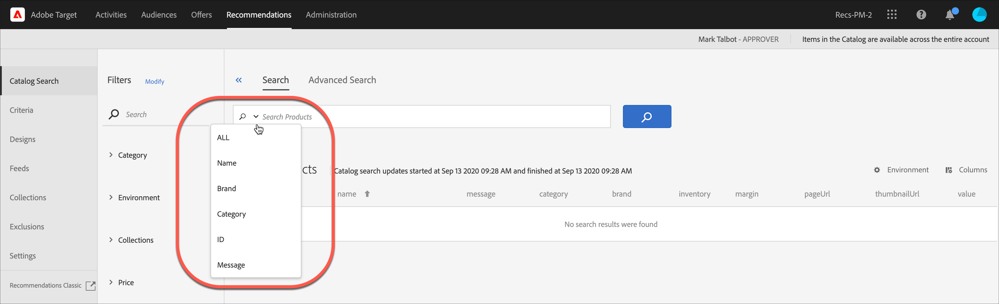

#  Catalog search {#catalog-search}

The [!UICONTROL Catalog Search] page helps you locate the products or content in your catalog.

Catalogs refer to your entire product set (entities). Your catalog can contain many collections--a way to organize your products in logical buckets.

To access the [!UICONTROL Catalog Search] page, click **[!UICONTROL Recommendations]** > **[!UICONTROL Catalog Search]**.

The most basic task you can perform on this page is to search for an item. In addition, you can change the environment; save search results to collections or exclusions; add, remove, or rearrange columns in the table, and add new search facets to the [!UICONTROL Filters] panel.

## Search for an item

You can use a simple search or an advanced search to locate items in your catalog.

### Perform a simple search

1. Type a search term in the **[!UICONTROL Search Products]** field.

1. (Optional) You can refine your search by selecting a search option from the options menu that displays when you click the down arrow in the search field.

   

   Search options include the following:

   * ALL - Searches across all of the other search criteria, using OR logic.
   * Name
   * Brand
   * Category
   * ID
   * Message

1. You can now scroll through the items in the search results to view thumbnails and other product information.

   The following illustration shows the results for "bike" using the All option.

   

   The number that displays next to "Products" is the number of products that match the search term, out of the total available in the specified environment.

   Notice that you can use the search auto-complete functionality. In the following illustration, typing "bik" returns all products that contain the word "bike."

   

1. You can also use filters to find the desired product. In the following example, by expanding the [!UICONTROL Collections] facet and selecting "Bike Tools," all bike tools in your catalog display.

   

1. You can search further in the results list by entering a search term, for example "chain."

   

### Perform an advanced search {#advanced}

You can use [!UICONTROL Advanced Search] to further refine your search results or to save your search results as a [collection](/help/c-recommendations/c-products/collections.md) or [exclusion](/help/c-recommendations/c-products/exclusions.md).

1. Click the **[!UICONTROL Advanced Search]**.

   

1. Use the drop-down lists to specify the parameter, operator, and values for your search.

1. (Optional) Click **[!UICONTROL Add Rule]** to add an additional search rule.

   Each additional search rule is joined with the AND operator.

1. Click **[!UICONTROL Search]**.

1. (Optional) Click **[!UICONTROL Save As]**, then click **[!UICONTROL Collection]** or **[!UICONTROL Exclusion]**.

   

   For more information, see [Create a collection or exclusion based on Advanced Search](/#save-as) below.

## View an item's details

You can view an individual item's details, including ID, name, message, category, and more by viewing its details.

1. Click an item in the search results to view its details.

   

## Remove an item from the catalog

1. Click an item in the search results to view its details.

1. Click **[!UICONTROL Remove from Catalog]**.

1. Confirm that you want to remove the item.

All information about that item is removed from the catalog index. The item will be included in your catalog only if it is added again in a data feed. A deleted item must be separately deleted from feeds.

## Refresh the catalog

The index of your catalog is automatically created when you upload your first feed, and refreshed according to the specified schedule.

The catalog is automatically refreshed when updates are received via feed files, API, or mbox updates. Updates are usually completed in an hour. If updates are in progress, the time that the most recent update started displays. If no updates are in progress, the time that the most recent update started and finished displays.

## Create a collection or exclusion based on Advanced Search {#save-as}

You can create [collections](/help/c-recommendations/c-products/collections.md) or [exclusions](/help/c-recommendations/c-products/exclusions.md) using [!UICONTROL Advanced Search] on the [!UICONTROL Catalog Search] page ([!UICONTROL Recommendations] > [!UICONTROL Catalog Search] > [!UICONTROL Advanced Search]).

1. Perform an [advanced search](/#advanced).

1. (Optional) Click **[!UICONTROL Save As]**, then click **[!UICONTROL Collection]** or **[!UICONTROL Exclusion]**.

   

   >[!IMPORTANT]
   >
   >The [!UICONTROL Advanced Search] functionality is case-insensitive; however, products returned at the time of delivery are based on case-sensitive search. This mismatch might lead to confusion. Ensure that you consider case-sensitivity when you create collections or exclusions based on results using the [!UICONTROL Advanced Search] functionality. For example, if you perform a search for "Holiday," that initial search lists results containing "Holiday" and "holiday." If you then create a catalog with the intent to return products containing "holiday," only products containing "holiday" are returned. Products containing "Holiday" are not returned. Exclusions are handled in a similar fashion.

## Change the environment

[Environments](/help/administrating-target/environments.md) let you organize your sites and pre-production environments for easy management and separated reporting.

1. Click the Environment link.

   

1. Select the desired environment.

## Modify the Catalog Search page (filters and columns)

You can temporarily modify the available filters and columns on the [!UICONTROL Catalog Search] page for the current session.

### Modify filters

You can add additional filter facets to the [!UICONTROL Catalog Search] page.

1. In the **[!UICONTROL Filters]** panel, click **[!UICONTROL Modify]**.

   

1. Select the desired search facets (ID, name, message, etc.).

Keep in mind that the additional filter facets are available in the current session only.

### Modify columns

You can temporarily modify the active columns on the [!UICONTROL Catalog Search] page.

1. Click the **[!UICONTROL Columns]** link.

   

1. (Conditional) To reorder the order of active columns, drag and drop the columns in the **[!UICONTROL Active Columns]** section in the desired order.

1. (Conditional) Drag and drop items from the **[!UICONTROL Active Columns]** to the **[!UICONTROL Inactive Columns]** (and vice versa), as desired.

   You can also click the delete icon ( x ) next to the column you want to move from the active to inactive section.

Keep in mind that the any changes you make apply to the current session only.
