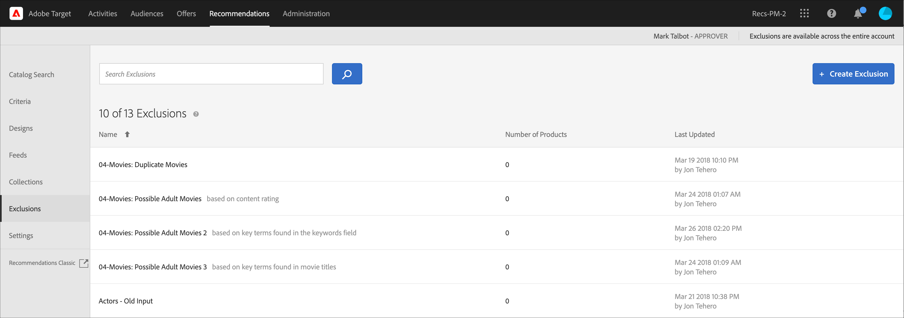

# Exclusions{#exclusions}

Create an exclusion in [!DNL Adobe Target Recommendations] to prevent products or content from being recommended to visitors.

An exclusion is a subset of products or content that should not be recommended to visitors. For example, you can use exclusions to prevent products or content from displaying in recommendations that have been discontinued or are sensitive in nature (such as movies with a rating not suitable for all based on content ratings).

Exclusions are available across the entire account.

>[!IMPORTANT]
>
>Static and dynamic exclusion rules are powerful features that can help you with your marketing efforts. For detailed information, examples, and use-case scenarios, see [Use Dynamic and Static Inclusion Rules](../../c-recommendations/c-algorithms/use-dynamic-and-static-inclusion-rules.md#concept_4CB5C0FA705D4E449BD0B37B3D987F9F).

## Create an exclusion

1. Click **[!UICONTROL Recommendations]** > **[!UICONTROL Exclusions]** to display the list of existing exclusions.

   

   The "Number of Items" reported for each exclusion on the [!UICONTROL Exclusions] list view is the number of products matching the rules for that exclusion within the configured default Recommendations [host group](/help/administrating-target/hosts.md) (environment). See [Settings](../../c-recommendations/plan-implement.md#concept_C1E1E2351413468692D6C21145EF0B84) to change the default host group.

1. Click **[!UICONTROL Create Exclusion]**.

1. (Conditional) Choose an environment from the **[!UICONTROL Environment]** filter while creating (or updating) an exclusion to preview the contents of the exclusion in that environment. By default, results from the default host group are displayed.

   

1. Type an exclusion **[!UICONTROL Name]** and enter an optional description.

1. Use the rule builder to create your exclusions.

   Select a parameter in the Rules list, select an operator, and then enter one or more values to identify the products. Separate multiple values with commas.

1. Click **[!UICONTROL Save]**.

## Create an exclusion using Advanced Search

You can also create exclusions using [!UICONTROL Advanced Search] on the [Catalog Search](/help/c-recommendations/c-products/catalog-search.md#save-as) page ( [!UICONTROL Recommendations] > [!UICONTROL Catalog Search] > [!UICONTROL Advanced Search]). 

After creating a search using "id > contains," for example, you can then click [!UICONTROL Save As] > [!UICONTROL Exclusion].

>[!IMPORTANT]
>
>The [!UICONTROL Advanced Search] functionality is case-insensitive; however, products returned at the time of delivery are based on case-sensitive search. This mismatch might lead to confusion. Ensure that you consider case-sensitivity when you create exclusions based on results using the Advanced Search functionality. For example, if you perform a search for "Holiday," that initial search lists results containing "Holiday" and "holiday." If you then create an exclusion with the intent to exclude products containing "holiday," only products containing "holiday" are excluded. Products containing "Holiday" are not excluded.

## Edit, copy, or delete an exclusion

Hover over the desired exclusion in the list, then click the appropriate icon: edit, copy, or delete.

You can copy an existing exclusion to create a duplicate exclusion that you can then modify. This lets you create a similar exclusion with less effort.

Be aware that exclusions are available across the entire account. Ensure that you consider this before deleting an exclusion. Deleted exclusions cannot be recovered.

## Training video: Create collections and exclusions in Recommendations (7:05) 

This video contains the following information:

* Create a collection
* Create an exclusion

>[!VIDEO](https://video.tv.adobe.com/v/27689)